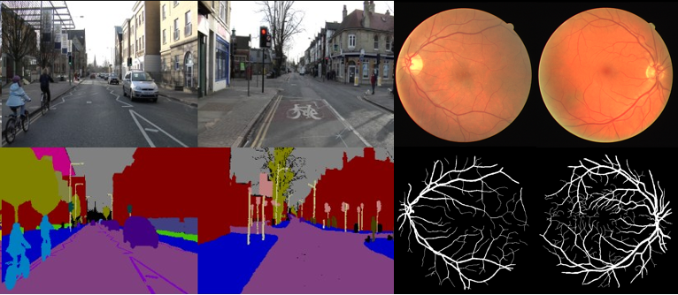
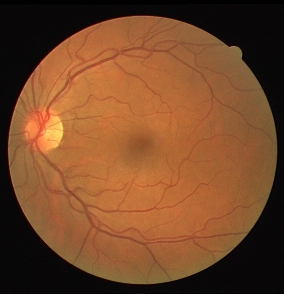
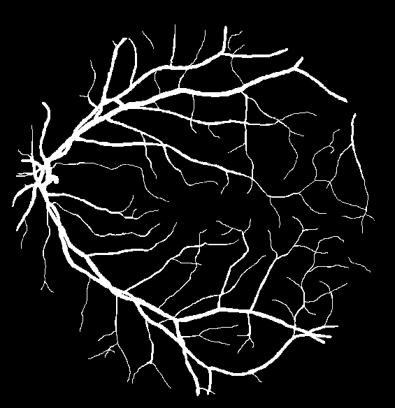

# Keras-Sematic-Segmentation


使用Keras实现深度学习中的一些语义分割模型。



# 配置
- tensorflow 1.13.1+tensorboard
- keras 2.2.4
- GTX 2080Ti x 2
- Cuda 10.0 + Cudnn7
- opencv-python
- labelme（标注数据需要用）
- PyCaffe（模型部署时用）

# 目录结构

- data 存储输入图像和语义分割标签的文件夹
```sh
- data
	- dataset_name
		- train_image
		- train_label
		- test_image
		- test_label
```

- Models 存储使用keras实现的一些经典分割模型
- utils 存储工具代码，如数据预处理，自定义resize方式等
- losses 常见的分割损失函数如Dice Loss，Tversky Loss等
- metrics 常见的分割评价指标，比如dice分数，f1分数等
- tools 模型转换工具，将输出的Keras模型转为caffe模型，再转到NCNN/TensorRT/OpenVINO等推理框架进行部署
- data.py 加载1个batch的原始图片和分割标签图片
- train.py 模型训练
- test.py 模型测试
- json_to_dataset.py 批量处理多张图片并一步建好所需目录及相关mask文件

# 已支持的分割模型

|model_name|Base Model|Segmentation Model|Params|FLOPs|Model Size|Available|
|---|---|---|---|---|---|---|
|enet|ENet|Enet|371,558|759,829|1.4Mb|True|
|fcn8|Vanilla CNN|FCN8|3,609,196|7220708|29.0Mb|True|
|unet|Vanilla CNN|UNet|7,167,618|14,344,197|57.6Mb|True|
|attunet|Vanilla CNN|AttUNet|8,913,058|17,841,087|71.7Mb|True|
|r2unet|Vanilla CNN|R2UNet|17,652,930|51,065,008|141.7Mb|True|
|r2attunet|Vanilla CNN|R2AttUNet|16,958,530|46,532,640|136.2Mb|True|
|unet++|Vanilla CNN|NestedUNet|9,171,170|18,353,631|73.7Mb|True|
|segnet|Vanilla CNN|SegNet|2,941,218|5,888,377|11.9Mb|True|
|icnet|Vanilla CNN|ICNet|6,740,610|13,524,726|27.6Mb|True|
|pspnet*|Vanilla CNN|PSPNet|964,226|8,894,120|3.9Mb|True|
|mobilenet_unet|MobileNet|MobileNetUnet|407,778|825,856|1.9Mb|True|
|mobilenet_fcn8|MobileNet|MobileNetFCN8|3,432,764|6,880,358|14Mb|False|
|seunet|SENet|SEUNet|1,964,530|3,932,843|8.2Mb|True|
|scseunet|SCSENet|scSEUNet|1,959,266|3,923,359|8.1Mb|True|
|vggunet|VGGNet|VGGUnet|25,884,170|51,789,952|103.8Mb|True|
|unet_xception_resnetblock|XceptionNet|Unet_Xception_ResNetBlock|38,431,730|88,041,130|154.5Mb|True|
|deeplab_v2|DeepLab|DeepLabV2|37,799,752|75,574,697|151.3Mb|True|
|hrnet|HRNet|HRNet|9524168|57,356,440|117.1Mb|True|

_注：测试数据是基于输入图片大小为224x224的二分类模型。对于标*号的模型，图片大小为模型定义里支持的最小大小。_

# <a name="sec_loss"></a> 已支持的损失函数

|Name (as argument)|Type|Available|
|---|---|---|
|ce|Cross Entropy|Yes|
|weighted_ce|Weighted Categorical loss|Yes|
|b_focal|Binary Focal loss|Yes|
|c_focal|Categorical Focal loss|Yes|
|dice|Dice loss|Yes|
|bce_dice|BCE + Dice loss|Yes|
|ce_dice|CE + Dice loss|Yes|
|g_dice|Generalized Dice loss|Yes|
|jaccard|Jaccard loss|Yes|
|bce_jaccard|BCE + Jaccard loss|Yes|
|ce_jaccard|CE + Jaccard loss|Yes|
|tversky|Tversky loss|Yes|
|f_tversky|Focal Tversky loss|Yes|

_注：weighted_ce 以及 c_focal 需要指定对应class的权重或者指定class数量。默认值为平分权重的二分类。_


# 已支持的评价指标

|Type|Available|
|---|---|
|iou_score|Yes|
|jaccard_score|Yes|
|f1_score|Yes|
|f2_score|Yes|
|dice_score|Yes|

# 已支持训练可视化

为了更好的监督训练过程,我们已经提供了训练可视化,对损失函数,iou_score,dice_socoe,f1_score,f2_score等进行了可视化.在训练过程中会在模型保
存的文件夹下生成log文件夹,例如`weights/unet/log`,然后使用`tensorboard --logdir=weights/unet/log`,打开得到的网址即可获得可视化结果.

# 训练

使用下面的命令训练和保存模型，模型保存路径，训练超参数需要灵活设置。

```sh
export CUDA_VISIBLE_DEVICES=0,1 # 使用的GPU序号
python train.py ...
```

可用参数如下：
- `--exp_name` 字符串，代表此次实验的名称，默认`exp1`。
- `--dataset_name` 字符串，代表选择对应的数据集的名称，默认`bbufdataset`，支持`camvid`。
- `--loss` 字符串，代表选择的损失函数的名称，默认`ce`，全部名称见[支持的损失函数](#sec_loss)。
- `--n_classes` 整型，代表分割图像中有几种类别的像素，默认为`2`。
- `--input_height`整型，代表要分割的图像需要`resize`的长，默认为`224`。
- `--input_width` 整型，代表要分割的图像需要`resize`的宽，默认为`224`。
- `--resize_op` 整型，代表`resize`的方式，如果为`1`则为普通`resize`，如果为2，则为`letterbox_resize`，默认为`1`。
- `--validate`布尔型，代表训练过程中是否需要验证集，默认为`True`，即使用验证集。
- `--epochs`整型，代表要训练多少个`epoch`，默认为`50`。
- `--train_batch_size`整型，代表训练时批量大小，默认为`4`。
- `--val_batch_size`整型，代表训练时批量大小，默认为`4`。
- `--model_name ` 字符串类型，代表训练时使用哪个模型，支持`enet`,`unet`,`segnet`,`fcn8`等多种模型，默认为`unet`。
- `--train_save_path`字符串类型，代表训练时保存模型的路径，默认为`weights/unet`，即会将模型保存在`weights`文件夹下，并且每个模型名字前缀以`unet`开头，后面接迭代次数和准确率构成完整的保存模型的路径。
- `--resume`字符串类型，代表继续训练的时候加载的模型路径，默认值为``，即从头训练。
- `--optimizer_name`字符串类型，代表训练模型时候的优化方法，支持`sgd`,`adam`,`adadelta`等多种优化方式，默认为`adadelta`。
- `--image_init`字符串类型，代表输入图片初始化方式，支持`sub_mean`，`sub_and_divide`，`divide`，默认为`divide`。
- `--multi_gpus` 布尔类型，代表使用是否多卡进行训练，默认为Fasle，如果为True，需将`gpu_count`参数设置为使用的显卡数量
- `--gpu_count` 整型，当`multi_gpus`为`True`时代表使用的GPU数量。需要配合设置相应的环境变量`CUDA_VISIBLE_DEVICES`。


# 训练示例

- 训练本工程提供的二分类数据集：`python train.py --dataset_name bbufdataset --model_name unet --input_height 224 --input_width 224 --image_init divide --n_classes 2`
- 训练CamVid数据集：`python train.py --dataset_name camvid --model_name unet --input_height 720 --input_width 960 --image_init sub_mean --n_classes 32 --train_batch_size 2 --val_batch_size 2`


# 测试

使用下面的命令测试模型，加载模型的路径，图像输入分辨率等参数需要灵活设置。

```sh
python test.py ...
```

可用参数如下：

- `--test_images`字符串类型，代表测试图所在的文件夹路径，默认为`data/test/`。
- `--output_path`字符串类型，代表从测试图预测出的`mask`图输出路径，默认为`data/output/`。
- `--model_name` 字符串类型，代表测试时使用哪个模型，支持`enet`,`unet`,`segnet`,`fcn8`等多种模型，默认为`unet`。
- `--weights_path`字符串类型，代表预测时加载的模型权重，默认为`weights/unet.18-0.856895.hdf5`，即对应默认模型`unet`训练出来的模型权重路径。
- `--input_height`整型，代表测试集输入到网络中需要被`resize`的长，默认为`224`。
- `--input_width`整型，代表测试集输入到网络中需要被`resize`的宽，默认为`224`。
- `--resize_op` 整型，代表`resize`的方式，如果为`1`则为普通`resize`，如果为2，则为`letterbox_resize`，默认为`1`。
- `--classes`整型，代表图片中的像素类别数，默认为`2`。
- `--mIOU`布尔型，代表是否启用评测`mIOU`，默认为`False`，一旦启用需要提供带有`mask`图的测试数据集。
- `--val_images`字符串类型，代表启用`mIOU`后测试集原图的路径，默认为`data/val_image/`。
- `--val_annotations`字符串类型，代表启用`mIOU`后测试集`mask`图的路径，默认为`data/val_label/`。
- `--image_init`字符串类型，代表输入图片初始化方式，支持`sub_mean`，`sub_and_divide`，`divide`，默认为`divide`。


# 测试示例

- 测试二分类数据集：`python test.py --model_name  unet --weights_path weights/unet.xx.hdf5 --classes 2 --image_init divide`
- 测试CamVid数据集：`python test.py --model_name unet --weights_path weights/unet.xx.hdf5 --classes 32 --image_init sub_mean --input_height 720 --input_width 960`


# 数据增强

实现中...

# 数据集

数据集制作使用`Labelme`即可，然后将得到的`json`文件使用`json_to_dataset.py`转换为本工程要用的`mask`标签图，具体操作步骤为：

-  使用本工程中的`json_to_dataset.py`替换掉`labelme/cli`中的相应文件—`json_to_dataset.py` 。在`cmd`中输入`python json_to_dateset.py  /path/你的json文件夹的路径`。注意是把每张图的`json`文件都放在一个目录下，`labelme`标注出来的默认是一张图片一个文件夹。
- 运行后，在`json`文件夹中会出现`mask_png、labelme_json`文件夹，`mask_png`中存放的是所有8位掩码文件！也即是本工程中使用的标签图。
- 具体来说，我们的标签图就是分别指示每张图片上每一个位置的像素属于几，`0`是背景，然后你要的类别从`1`开始往后递增即可。
- 
- 本工程训练和测试的一个2类的简单分割数据集，下载地址为：https://pan.baidu.com/s/1sVjBfmgALVK7uEjeWgIMug
- 本工程训练和测试的CamVid数据集，下载地址为：https://pan.baidu.com/s/1zequLd0aYXNseGoXn-tdog
- 本工程训练和测试的一个包的数据集，下载地址为：https://pan.baidu.com/s/1iau4E0tjm6179z_XTSqExw，提取码：sg22


# Model Zoo

已经训练好的Keras模型放在这个工程下，模型按照名字进行对应：

https://github.com/BBuf/Keras-Semantic-Segmentation-Model-Zoo

# 模型部署

首先将Keras模型转为Caffe模型，然后再转为NCNN/OpenVINO/TensorRT/M模型进行部署，已支持转换OP和网络如下。

## 已支持OP

- InputLayer
- Conv2D/Convolution2D
- Conv2DTranspose
- DepthwiseConv2D
- SeparableConv2D
- BatchNormalization
- Dense
- ReLU
- ReLU6
- LeakyReLU
- SoftMax
- SigMoid
- Cropping2D
- Concatenate
- Merge
- Add
- Flatten
- Reshape
- MaxPooling2D
- AveragePooling2D
- Dropout
- GlobalAveragePooling2D
- UpSampling2D
- ...

## 已支持网络
- VGG16
- SqueezeNet
- InceptionV3
- InceptionV4
- Xception V1
- UNet
- ...


# 标准

## 个人制作2个类别小零件数据集分割结果


|Resolution|ResizeOp|Epoch|model_name|Base Model|Segmentation Model|Acc|iou_score|dice_score|f1_score|f2_score|
| --- | --- |---|---|---|---|---|---|---|---|---|
|224x224|1|50|enet|ENet|Enet|||||
|224x224|1|50|fcn8|Vanilla CNN|FCN8|||||
|224x224|1|50|unet|Vanilla CNN|UNet|||||
|224x224|1|50|attunet|Vanilla CNN|AttUNet|||||
|224x224|1|50|r2unet|Vanilla CNN|R2UNet|||||
|224x224|1|50|r2attunet|Vanilla CNN|R2AttUNet|||||
|224x224|1|50|unet++|Vanilla CNN|NestedUNet|||||
|224x224|1|50|segnet|Vanilla CNN|SegNet|||||
|224x224|1|50|icnet|Vanilla CNN|ICNet|||||
|384x384|1|50|pspnet|Vanilla CNN|PSPNet|||||
|224x224|1|50|mobilenet_unet|MobileNet|MobileNetUnet|||||
|224x224|1|50|mobilenet_fcn8|MobileNet|MobileNetFCN8|||||
|224x224|1|50|seunet|SENet|SEUNet|||||
|224x224|1|50|scseunet|SCSENet|scSEUNet|||||
|224x224|1|50|vggunet|VGGNet|VGGUnet|||||
|224x224|1|50|unet_xception_resnetblock|XceptionNet|Unet_Xception_ResNetBlock|||||
|320x320|1|50|deeplab_v2|DeepLab|DeepLabV2|||||
|224x224|1|50|hrnet|HRNet|HRNet|||||


## CamVid分割数据集分割结果

|Resolution|ResizeOp|Epoch|model_name|Base Model|Segmentation Model|Acc|iou_score|dice_score|f1_score|f2_score|
| --- | --- | ---|---|---|---|---|---|---|---|---|
|960x704|1|50|enet|ENet|Enet|||||
|960x704|1|50|fcn8|Vanilla CNN|FCN8|||||
|960x720|1|50|unet|Vanilla CNN|UNet|||||
||1|50|attunet|Vanilla CNN|AttUNet|||||
||1|50|r2unet|Vanilla CNN|R2UNet|||||
||1|50|r2attunet|Vanilla CNN|R2AttUNet|||||
||1|50|unet++|Vanilla CNN|NestedUNet|||||
||1|50|segnet|Vanilla CNN|SegNet|||||
||1|50|icnet|Vanilla CNN|ICNet|||||
||1|50|pspnet|Vanilla CNN|PSPNet|||||
||1|50|mobilenet_unet|MobileNet|MobileNetUnet|||||
||1|50|mobilenet_fcn8|MobileNet|MobileNetFCN8|||||
||1|50|seunet|SENet|SEUNet|||||
||1|50|scseunet|SCSENet|scSEUNet|||||
||1|50|vggunet|VGGNet|VGGUnet|||||
||1|50|unet_xception_resnetblock|XceptionNet|Unet_Xception_ResNetBlock|||||
||1|50|deeplab_v2|DeepLab|DeepLabV2|||||
||1|50|hrnet|HRNet|HRNet|||||

## 眼球血管分割数据集

- 全部基于UNet进行测试，这个数据集是为了测试工程中支持的各种损失函数的效果。以下指标在测试集上报告。

|Resolution|ResizeOp|Epoch|Loss Name|Acc|iou_score|dice_score|f1_score|f2_score|
| --- | --- | ---|---|---|---|---|---|---|
|224x224|1|50|ce|0.9238|0.7817|0.8770|0.8770|0.8770|
||1|50|weighted_ce|0.9194|0.8329|0.9088|0.9088|0.9088|
||1|50|b_focal|0.9106|0.6103|0.7579|0.7579|0.7579|
||1|50|c_focal|0.9194|0.8301|0.9071|0.9071|0.9071|
||1|50|dice|0.9198|0.7429|0.8523|0.8523|0.8523|
||1|50|bce_dice|0.9307|0.7628|0.8653|0.8653|0.8653|
||1|50|ce_dice||||||
||1|50|g_dice||||||
||1|50|jaccard||||||
||1|50|bce_jaccard||||||
||1|50|ce_jaccard||||||
||1|50|tversky||||||
||1|50|f_tversky||||||


## 个人制作2个类别小零件数据集分割可视化结果


|     Input Image      | Output Segmentation Image |
| :------------------: | :-----------------------: |
|  |    |


## CamVid数据集分割可视化结果


|     Input Image     | Output Segmentation Image |
| :-----------------: | :-----------------------: |
|  |  |


## 眼球病变数据集分割可视化结果

|     Input Image     | Output Segmentation Image |
| :-----------------: | :-----------------------: |
|  |  |


# 参考

- https://github.com/divamgupta/image-segmentation-keras
- https://github.com/uhfband/keras2caffe


# 微信公众号&交流群


- QQ群号 1030186545
- 加群密码 qqq


