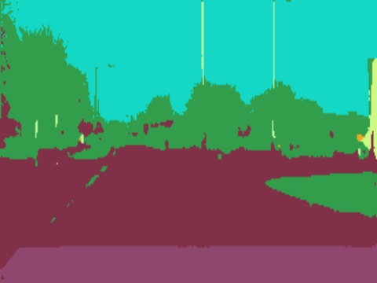

# Keras-Sematic-Segmentation

使用Keras实现深度学习中的一些语义分割模型。


# 配置
- tensorflow 1.8.0
- keras 2.2.4
- GTX 2070/CPU
- opencv

# 目录结构

- data 存储输入图像和语义分割标签的文件夹
```
- data
	- dataset_name
		- train_image
		- train_label
		- test_image
		- test_label
```

- Models 存储使用keras实现的一些经典分割模型
- utils 存储工具代码，如数据预处理
- data.py 加载1个batch的原始图片和分割标签图片
- train.py 模型训练
- test.py 模型测试
# 已支持的分割模型

|Epoch|model_name|Base Model|Segmentation Model|Available|
| ---|---|---|---|---|
|50|enet|ENet|Enet|True|
|50|fcn8|Vanilla CNN|FCN8|True|
|50|unet|Vanilla CNN|UNet|True|
|50|segnet|Vanilla CNN|SegNet|True|
|50|icnet|Vanilla CNN|ICNet|True|
|50|pspnet|Vanilla CNN|PSPNet|True|
|50|mobilenet_unet|MobileNet|MobileNetUnet|True|
|50|mobilenet_fcn8|MobileNet|MobileNetFCN8|True|


# 训练

使用下面的命令训练和保存模型，模型保存路径，训练超参数需要灵活设置。

```python
python train.py 
```

可用参数如下：

- `--dataset_name` 字符串，代表选择对应的数据集的名称，默认streetscape
- `--n_classes` 整型，代表分割图像中有几种类别的像素，默认为`2`。
- `--input_height`整型，代表要分割的图像需要`resize`的长，默认为`224`。
- `--input_width` 整型，代表要分割的图像需要`resize`的宽，默认为`224`。
- `--resize_op` 整型，代表`resize`的方式，如果为`1`则为默认`resize`，如果为2，则为`letterbox_resize`。
- `--validate`布尔型，代表训练过程中是否需要验证集，默认为`True`，即使用验证集。
- `--epochs`整型，代表要训练多少个`epoch`，默认为`50`。
- `--train_batch_size`整型，代表训练时批量大小，默认为`4`。
- `--model_name ` 字符串类型，代表训练时使用哪个模型，支持`enet`,`unet`,`segnet`,`fcn8`等多种模型，默认为`unet`。
- `--train_save_path`字符串类型，代表训练时保存模型的路径，默认为`weights/unet`，即会将模型保存在`weights`文件夹下，并且每个模型名字前缀以`unet`开头，后面接迭代次数和准确率构成完整的保存模型的路径。
- `--resume`字符串类型，代表继续训练的时候加载的模型路径，默认值为``，即从头训练。
- `--optimizer_name`字符串类型，代表训练模型时候的优化方法，支持`sgd`,`adam`,`adadelta`等多种优化方式，默认为`adadelta`。
- `--image_init`字符串类型，代表输入图片初始化方式，支持`sub_mean`，`sub_and_divide`，`divide`，默认为`sub_mean`。


# 训练示例

- 训练本工程提供的二分类数据集：`python train.py  --model_name unet --image_init divide --n_classes 2`
- 训练12个类别的城市街景分割数据集：`python train.py --model_name unet --input_height 320 --input_width 640 --image_init sub_mean --n_classes 12`


# 测试

使用下面的命令测试模型，加载模型的路径，图像输入分辨率等参数需要灵活设置。

```python
python test.py
```

可用参数如下：

- `--test_images`字符串类型，代表测试图所在的文件夹路径，默认为`data/test/`。
- `--output_path`字符串类型，代表从测试图预测出的`mask`图输出路径，默认为`data/output/`。
- `--model_name` 字符串类型，代表测试时使用哪个模型，支持`enet`,`unet`,`segnet`,`fcn8`等多种模型，默认为`unet`。
- `--weights_path`字符串类型，代表预测时加载的模型权重，默认为`weights/unet.18-0.856895.hdf5`，即对应默认模型`unet`训练出来的模型权重。
- `--input_height`整型，代表测试集输入到网络中需要被`resize`的长，默认为`224`。
- `--input_width`整型，代表测试集输入到网络中需要被`resize`的宽，默认为`224`。
- `--resize_op` 整型，代表`resize`的方式，如果为`1`则为默认`resize`，如果为2，则为`letterbox_resize`。
- `--classes`整型，代表图片中的像素类别数，默认为`2`。
- `--mIOU`布尔型，代表是否启用评测`mIOU`，默认为`False`，一旦启用需要提供带有`mask`图的测试数据集。
- `--val_images`字符串类型，代表启用`mIOU`后测试集原图的路径，默认为`data/val_image/`。
- `--val_annotations`字符串类型，代表启用`mIOU`后测试集`mask`图的路径，默认为`data/val_label/`。
- `--image_init`字符串类型，代表输入图片初始化方式，支持`sub_mean`，`sub_and_divide`，`divide`，默认为`sub_mean`。


# 测试示例

- 测试二分类数据集：`python test.py --model_name  unet --weights_path weight/unet.xx.hdf5 --classes 2 --image_init divide`
- 测试城市街景分割数据集：`python test.py --model_name unet --weights_path weights/unet.xx.hdf5 --classes 12 --image_init sub_mean --input_height 320 --input_width 640 --resize_op 2(2代表使用letterbox方式进行resize)`


# 数据集

数据集制作使用`Labelme`即可，然后将得到的`json`文件使用`json_to_dataset.py`转换为本工程要用的`mask`标签图，具体操作步骤为：

-  使用本工程中的`json_to_dataset.py`替换掉`labelme/cli`中的相应文件—`json_to_dataset.py` 。在`cmd`中输入`python json_to_dateset.py  /path/你的json文件夹的路径`。注意是把每张图的`json`文件都放在一个目录下，`labelme`标注出来的默认是一张图片一个文件夹。
- 运行后，在`json`文件夹中会出现`mask_png、labelme_json`文件夹，`mask_png`中存放的是所有8位掩码文件！也即是本工程中使用的标签图。
- 具体来说，我们的标签图就是分别指示每张图片上每一个位置的像素属于几，`0`是背景，然后你要的类别从`1`开始往后递增即可。
- 本工程测试的一个2类的简单分割数据集，下载地址为：https://pan.baidu.com/s/1sVjBfmgALVK7uEjeWgIMug
- 本工程测试的城市街景分割数据集，下载地址为：https://pan.baidu.com/s/1zequLd0aYXNseGoXn-tdog
- 本工程测试的人脸部位分割数据集，下载地址为：https://pan.baidu.com/s/1uXZX9c8VFZYVP-ru5MOXXA ，提取码为：09ry 。数据集来源：https://blog.csdn.net/yuanlulu/article/details/89789807


# Benchmark(陆续公开)

## 个人制作2个类别小零件数据集分割结果


|Epoch|model_name|Base Model|Segmentation Model|Train Acc|Train Loss|Val Acc|Val Loss|Test mIOU|
| ---|---|---|---|---|---|---|---|---|
|50|enet|ENet|Enet|0.99|0.02|0.98|0.02|0.91|
|50|fcn8|Vanilla CNN|FCN8|0.99|0.02|0.98|0.04|0.93|
|50|unet|Vanilla CNN|UNet|0.99|0.02|0.99|0.03|0.94|
|50|segnet|Vanilla CNN|SegNet|0.99|0.02|0.99|0.02|0.94|
|50|icnet|Vanilla CNN|ICNet|0.99|0.02|0.99|0.02|0.94|
|50|pspnet|Vanilla CNN|PSPNet|0.99|0.02|0.99|0.02|0.94|
|50|mobilenet_unet|MobileNet|MobileNetUnet|0.99|0.02|0.99|0.02|0.94|
|50|mobilenet_fcn8|MobileNet|MobileNetFCN8|0.99|0.02|0.99|0.02|0.94|


## 城市街景分割数据集分割结果


|Epoch|model_name|Base Model|Segmentation Model|Train Acc|Train Loss|Val Acc|Val Loss|Test mIOU|
| ---|---|---|---|---|---|---|---|---|
|50|enet|ENet|Enet|0.71|0.90|0.64|1.02|0.20|
|50|fcn8|Vanilla CNN|FCN8|0.85|0.53|0.67|1.01|0.25|
|50|unet|Vanilla CNN|UNet|0.78|0.78|0.62|1.14|0.19|
|50|segnet|Vanilla CNN|SegNet|0.41|1.64|0.31|1.94|0.19|
|50|icnet|Vanilla CNN|ICNet|0.89|0.38|0.72|0.84|0.33|
|50|pspnet(576x384)|Vanilla CNN|PSPNet| 0.88      | 0.41       | 0.73    | 0.88     | 0.33      |
|50|mobilenet_unet|MobileNet|MobileNetUnet|0.90|0.36|0.73|0.87|0.34|
|50|mobilenet_fcn8|MobileNet|MobileNetFCN8|0.70|0.92|0.58|1.25|0.17|
|50|seunet|Vanilla CNN|SEUnet|0.84|0.59|0.77|0.79|0.34|


## 人脸部位分割数据集

|Epoch|model_name|Base Model|Segmentation Model|Train Acc|Train Loss|Val Acc|Val Loss|Test mIOU|
| ---|---|---|---|---|---|---|---|---|
|50|enet|ENet|Enet| 0.80      | 0.61       | 0.84    | 0.54     | 0.10      |
|50|fcn8|Vanilla CNN|FCN8|0.89|0.36|0.86|0.47|0.17|
|50|unet|Vanilla CNN|UNet|0.91|0.31|0.83|0.62|0.17|
|50|segnet|Vanilla CNN|SegNet|0.76|0.86|0.79|0.79|0.06|
|50|icnet|Vanilla CNN|ICNet|0.86|0.42|0.85|0.44|0.11|
|50|pspnet|Vanilla CNN|PSPNet|0.86|0.40|0.85|0.42|0.18|
|50|mobilenet_unet|MobileNet|MobileNetUnet|0.83|0.49|0.95|0.45|0.14|
|50|mobilenet_fcn8|MobileNet|MobileNetFCN8|0.76|0.87|0.79|0.77|0.06|


## 个人制作2个类别小零件数据集分割可视化结果


|     Input Image      | Output Segmentation Image |
| :------------------: | :-----------------------: |
|  |    |


## 城市街景分割数据集分割可视化结果


|     Input Image     | Output Segmentation Image |
| :-----------------: | :-----------------------: |
|  |  |


## 人脸部位分割数据集分割可视化结果


## TODO

- 支持DeepLab，UNet++等。
- 数据增强策略。
- 支持OpenVINO和TensorRT部署。


# 参考

- https://github.com/divamgupta/image-segmentation-keras
- https://blog.csdn.net/u014513323/article/details/81166997


# 我的微信公众号


